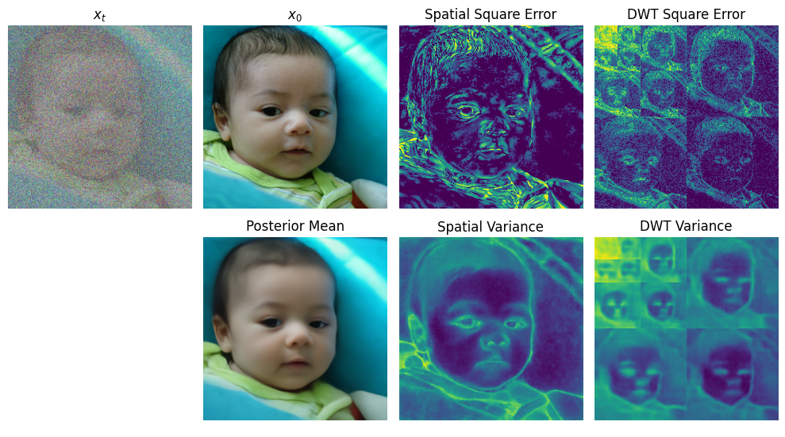

# Improving Diffusion Models for Inverse Problems Using Optimal Posterior Covariance

This repository contains the code and data associated with the paper [Improving Diffusion Models for Inverse Problems Using Optimal Posterior Covariance](https://arxiv.org/abs/2402.02149).

This code is based on the 

- [K diffusion](https://github.com/crowsonkb/k-diffusion): Provide the code structure.

- [DPS](https://github.com/DPS2022/diffusion-posterior-sampling): Provide the code for degradation opterators.

- [DiffPIR](https://github.com/yuanzhi-zhu/DiffPIR): Provide tools for implementing closed-form solutions.

- [GPyTorch](https://github.com/cornellius-gp/gpytorch): Provide tools for implementing differentiable Gaussian likelihoods, enabling auto-computed Type I guidance (Use `--guidance autoI`).

___________
**Contents**
- [Abstract](#abstract)
- [Brief Introduction](#brief-introduction)
  - [Unified Intepretation of Diffusion-based Solvers to Inverse Problems](#unified-interpretation-of-diffusion-based-solvers-to-inverse-problems)
  - [Solving Inverse Problems With Optimal Posterior Covariance](#solving-inverse-problems-with-optimal-posterior-covariance)
- [Setting Up](#setting-up)
  - [Setup Conda Environment](#setup-conda-environment)
  - [Models and Analytic Variances](#models-and-analytic-variances)
  - [Reproduce Results](#reproduce-results)
  - [Additional Results with Latent Variance](#additional-results-with-latent-variance)
    - [Discrete Cosine Transform](#discrete-cosine-transform)
    - [Discrete Wavelet Transform (Best Performance)](#discrete-wavelet-transform)
- [Citation](#citation)
- [Acknowledgments](#acknowledgments)

## Abstract

Recent diffusion models provide a promising zero-shot solution to noisy linear inverse problems
without retraining for specific inverse problems. In this paper, we propose the first unified interpretation for existing zero-shot methods from the perspective of approximating the conditional posterior mean for the reverse diffusion process of conditional sampling. We reveal that recent methods are equivalent to making isotropic Gaussian approximations to intractable posterior distributions over clean images given diffused noisy images, with the only difference in the handcrafted design of isotropic posterior covariances. Inspired by this finding, we propose a general plug-and-play posterior covariance optimization based on maximum likelihood estimation to improve recent methods. To achieve optimal posterior covariance without retraining, we provide general solutions based on two approaches specifically designed to leverage pre-trained models with and without reverse covariances. Experimental results demonstrate that the proposed methods significantly enhance the overall performance or robustness to hyperparameters of recent methods.


## Brief Introduction

### Unified Intepretation of Diffusion-based Solvers to Inverse Problems
We provide unified intepretation of previous diffusion-based solvers to inverse problems from the view of approximating the conditional posterior mean $\mathbb{E}[x_0|x_t,y]$. Specifically, we classify them into two categories, Type I and Type II guidance, according to approximation paradigms, as elaborated below.

**Type I guidance.** We classify [DPS](https://arxiv.org/pdf/2209.14687.pdf) and [PiGDM](https://openreview.net/forum?id=9_gsMA8MRKQ) into one category, referred to as Type I guidance, where the conditional posterior mean $\mathbb{E}[x_0|x_t, y]$ is approximated based on the following relationship:

$$
\mathbb{E}[x_0|x_t,y] = \mathbb{E}[x_0|x_t] + s_t \sigma_t^2 \nabla_{x_t} \log p_t(y|x_t)
$$

where $p_t(y|x_t)$ is given by an intractable integral $\mathbb{E}_{p_t(x_0|x_t)}[p(y|x_0)]$. By introducing an isotrophic Gaussian approximation $q_t(x_0|x_t)=\mathcal{N}(\mathbb{E}[x_0|x_t], r_t^2 I)$ for $p_t(x_0|x_t)$, we can obtain the following approximation by Gaussian marginalization:

$$
p_t(y|x_t) \approx \mathcal{N}(y|A\mathbb{E}[x_0|x_t], \sigma^2 I + r_t^2 A A^T)
$$

**Type II guidance.** We classify [DiffPIR](https://arxiv.org/pdf/2305.08995.pdf) and [DDNM](https://arxiv.org/pdf/2212.00490.pdf) into the category of Type II guidance, which approximates $\mathbb{E}[x_0|x_t, y]$ with the solution of the following proximal problem:

$$
\mathbb{E}[x_0|x_t,y] \approx \arg\min_{x_0} \lVert y - A x_0 \rVert^2_2  + \frac{\sigma^2}{r_t^2} \lVert x_0 - \mathbb{E}[x_0|x_t] \rVert^2_2
$$

which can be intepreted as compute the mean of an approximate distribution $q_t(x_0|x_t,y) \propto p(y|x_0)q_t(x_0|x_t)$  for the conditional posterior $p_t(x_0|x_t,y)\propto p(y|x_0)p_t(x_0|x_t)$.

### Solving Inverse Problems with Optimal Posterior Covariance

In our study, we generalize the above guidances based on variational Gaussian posterior with general covariance $q_t(x_0|x_t)=\mathcal{N}(\mu_t(x_t), \Sigma_t(x_t))$, such that

**Type I guidance.** The likelihood is approximated in a similar way by Gaussian marginalization:

$$
p_t(y|x_t) \approx \mathcal{N}(y|A\mu_t(x_t), \sigma^2 I + A \Sigma_t(x_t) A^T)
$$

**Type II guidance.** $\mathbb{E}[x_0|x_t,y]$ is approximated with the solution of the following auto-weighted proximal problem:

$$
\mathbb{E}[x_0|x_t,y] \approx  \arg\min_{x_0} \lVert y - A x_0 \rVert^2  + \sigma^2 \lVert x_0 - \mu_t(x_t) \rVert^2_{\Sigma_t^{-1}(x_t)}
$$


## Setting Up
### Setup Conda Environment
For creating the conda environment and installing dependencies run
```
conda env create -f environment.yml
```
Then activate the environment by
```
conda activate k-diffusion
```

### Models and Analytic Variances
From the [link](https://drive.google.com/drive/folders/1jElnRoFv7b31fG0v6pTSQkelbSX3xGZh?usp=sharing), download the FFHQ checkpoint ```ffhq_10m.pt```, rename to ```diffusion_ffhq_10m.pt```, and paste it to ```../model_zoo```.

To run guidance based on analytic posterior covariance, download the precomputed Monte Carlo estimation from the [link](https://drive.google.com/drive/folders/1D93IZU0ViyExWm1k-L6dRehDHs1jAxGx?usp=drive_link), and paste it to ```./runs```.

### Reproduce Results
From the [link](https://drive.google.com/file/d/1I8at4Y1MPrKV8yPHq_6sn6Et7Elyxavx/view?usp=drive_link), download the validation data (the first 100 images from [FFHQ](https://github.com/NVlabs/ffhq-dataset) and [ImageNet](https://image-net.org/) datasets), unzip and paste it to ```../data```.

For reproducing results on FFHQ dataset in Table 3, run
```bash
bash quick_start/eval_guidance_I.sh ffhq
```

For reproducing results on FFHQ dataset in Figure 3, run
```bash
bash quick_start/eval_guidance_II.sh ffhq
```

For reproducing results on FFHQ dataset in Table 4, run
```bash
bash quick_start/eval_complete_pgdm.sh ffhq
bash quick_start/eval_complete_pgdm+mle.sh ffhq analytic
bash quick_start/eval_complete_pgdm+mle.sh ffhq convert
```

For reproducing results on FFHQ dataset in Figure 4, run
```bash
bash quick_start/eval_complete_dps.sh ffhq
bash quick_start/eval_complete_dps+mle.sh ffhq analytic
bash quick_start/eval_complete_dps+mle.sh ffhq convert
```

## Additional Results with Latent Variance
### Discrete Cosine Transform
We provide additonal experimental results (Appendix D.5) for demonstrating that the proposed method has the potential for generalizing to correlated (non-diagonal) posterior covariance. To reproduce the results based on learned Discrete Cosine Transform (DCT) variance, from the [link](https://drive.google.com/file/d/1YsM-QhEc0TwJHe2q22Zkd_Y7fL1UswGj/view?usp=drive_link), download the FFHQ checkpoint ```ffhq_dct.pth``` and paste it to ```../model_zoo```.

For reproducing results on FFHQ dataset in Table 5, run
```bash
bash quick_start/dct_var/eval_guidance_I.sh 0
bash quick_start/dct_var/eval_guidance_I.sh 1
bash quick_start/dct_var/eval_guidance_I_spatial_var.sh 0.2

bash quick_start/dct_var/eval_guidance_II.sh 0
bash quick_start/dct_var/eval_guidance_II.sh 1
bash quick_start/dct_var/eval_guidance_II_spatial_var.sh 0.2
```
### Discrete Wavelet Transform
We also provide checkpoint for learned Discrete Wavelet Transform (DWT) variance. Example model outputs (bottom) are given as follows:



To test the performance with DWT variance, please download the FFHQ checkpoint ```ffhq_dwt.ckpt``` from the [link](https://drive.google.com/file/d/1ARbLbss9ByMOtF-7cl9_Yd2OupKk-72m/view?usp=drive_link) to ```../model_zoo```, and test with

```bash
bash quick_start/dwt_var/eval_guidance_I.sh 1
bash quick_start/dwt_var/eval_guidance_II.sh 1
```


## Citation
If you find this repo helpful, please cite:

```bibtex
@misc{peng2024improving,
      title={Improving Diffusion Models for Inverse Problems Using Optimal Posterior Covariance}, 
      author={Xinyu Peng and Ziyang Zheng and Wenrui Dai and Nuoqian Xiao and Chenglin Li and Junni Zou and Hongkai Xiong},
      year={2024},
      eprint={2402.02149},
      archivePrefix={arXiv},
      primaryClass={cs.CV}
}
```


